# Praxis System

Ein modular aufgebautes Praxisverwaltungssystem auf Basis von .NET zur digitalen Organisation von Patienten, Terminen und Abrechnungsprozessen.
Das System ist als mehrschichtige Anwendung konzipiert und trennt klar zwischen Benutzeroberfläche, Geschäftslogik und Datenzugriff.

---
### Ziel des Projekts

Dieses Projekt dient der Entwicklung einer strukturierten und skalierbaren Softwarelösung für Arztpraxen oder medizinische Einrichtungen, mit Fokus auf:
- effiziente Patientenverwaltung
- strukturierte Terminplanung
- nachvollziehbare Abrechnung
- saubere Softwarearchitektur (Clean Architecture Prinzipien)

---

##  Features

*  Patientenverwaltung
*  Terminplanung & Kalender
*  Abrechnung & Rechnungsstellung
*  Medikamenten- & Diagnosenverwaltung
*  Dokumentenmanagement (z. B. Arztbriefe, PDFs)
*  Dashboard & Berichte
*  Benutzer- & Authentifizierungssystem
*  Erinnerungen & Benachrichtigungen

---

## Projektstruktur

Das Projekt ist in mehrere Layer aufgeteilt (Clean Architecture):

* **Praxis.Application**
  Geschäftslogik und Services (z. B. PatientService, AppointmentService)

* **Praxis.Client**
  Benutzeroberfläche ( WPF oder Desktop-App)

* **Domain / Cor**
  Modelle und zentrale Geschäftsregeln

* **Infrastructure**
  Datenbank, externe Services etc.

---

## Installation & Start

### Voraussetzungen

* [.NET SDK](https://dotnet.microsoft.com/) (Version X.X)
* Visual Studio 

### Schritte

```bash
# Repository klonen
git clone https://github.com/DEIN-USERNAME/praxis-system.git

# Projekt öffnen
PraxisSystem.sln
```

Dann in Visual Studio:

* Lösung öffnen
* Startprojekt auswählen (`Praxis.Client`)
   Starten

---

## Konfiguration

Die Konfiguration erfolgt über:

```json
Praxis.Client/appsettings.json
```

Hier kannst du z. B. anpassen:

* Datenbankverbindung
* API-Endpoints
* Logging
---

## Technische Details

* Sprache: C#
* Framework: .NET
* Architektur: Clean Architecture / Layered Architecture
* Prinzipien:
** Separation of Concerns
** Dependency Injection (vorbereitet durch Interfaces)
** Erweiterbarkeit durch modulare Services
---
##  Kernfunktionen

 Patientenverwaltung
Anlegen, Bearbeiten und Löschen von Patienten
Speicherung relevanter Stammdaten

 Terminmanagement
Erstellung und Verwaltung von Terminen
Zuordnung zu Patienten
Übersicht über geplante Termine

 Abrechnungssystem
Erstellung von Rechnungen
Verknüpfung mit Patienten und Leistungen

 Dokumentenmanagement
Verwaltung von Dateien (z. B. PDFs)
Zuordnung zu Patientenakten

 Dashboard
Übersicht über wichtige Praxiskennzahlen
Aggregation von Daten aus verschiedenen Services

---

##  Architektur

Das System folgt einer **schichtenbasierten Architektur**:

* Trennung von UI, Business-Logik und Datenzugriff
* Verwendung von Interfaces für Services
* Gute Testbarkeit & Erweiterbarkeit

---

##  Tests

Für zentrale Services der Anwendung existieren Unit Tests im Projekt `Praxis.Tests`.

Getestete Bereiche:

- `AppointmentService`
- `PatientService`
- `AuthService`
- `DashboardService`
- `DocumentService`
- `PrescriptionService`
- `UserManagementService`

Ausführung:

```bash
dotnet test PraxisSystem.sln

---

##  Screenshots

### Benutzeranmeldung 
![Anmeldung] (screenshots/Benutzeranmeldung.jpg)

### Patientenverwaltung
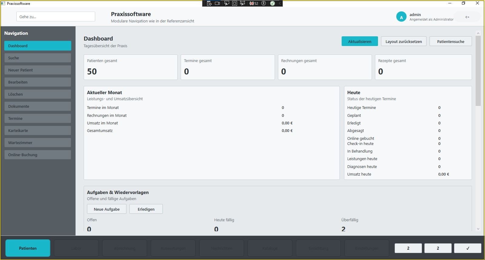
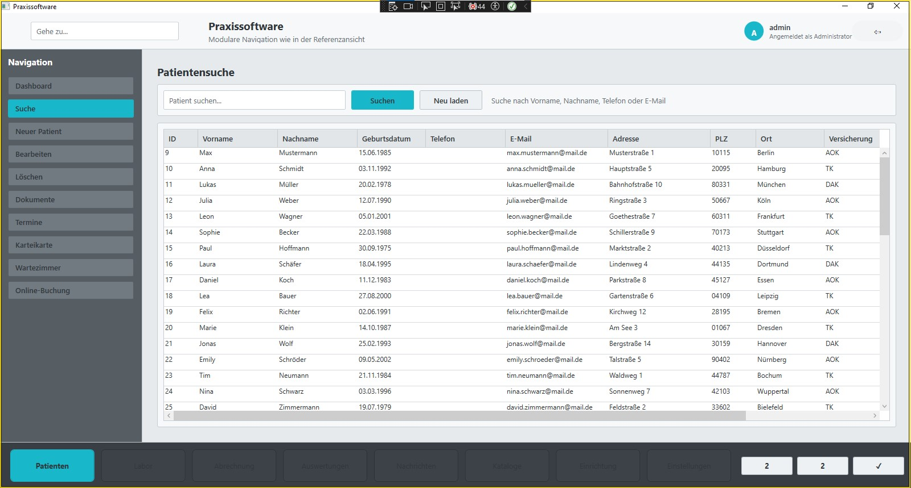

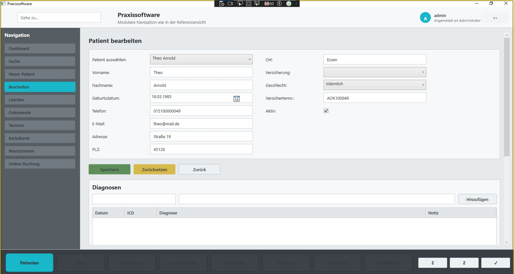
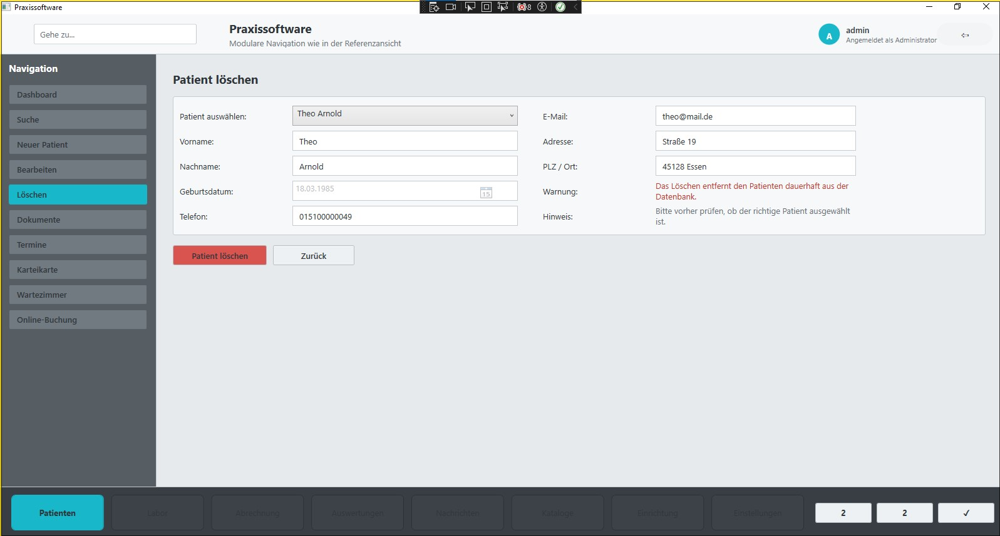
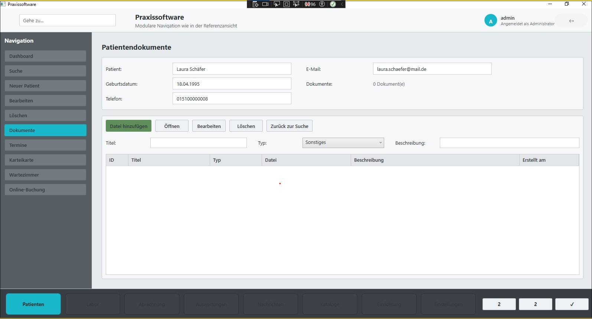
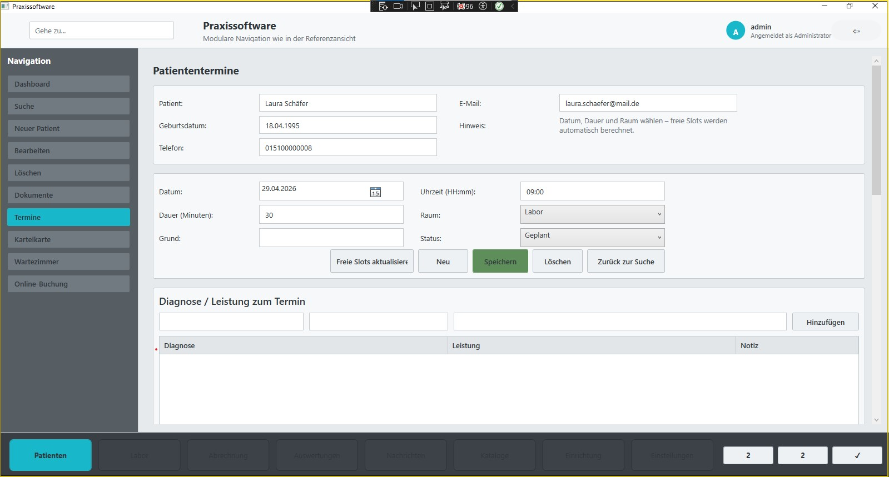
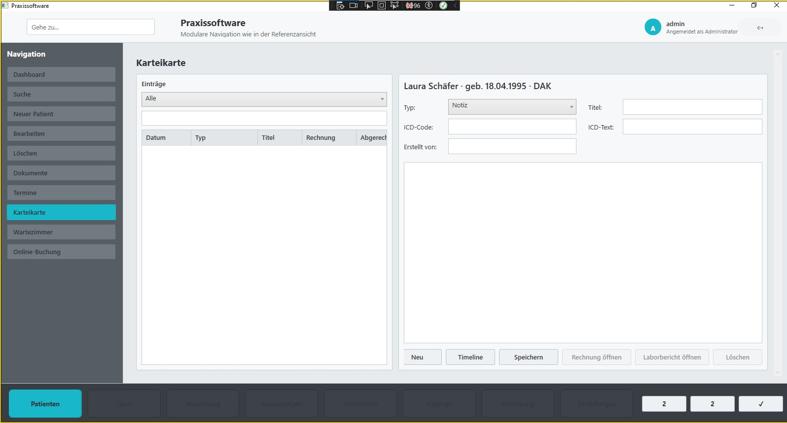
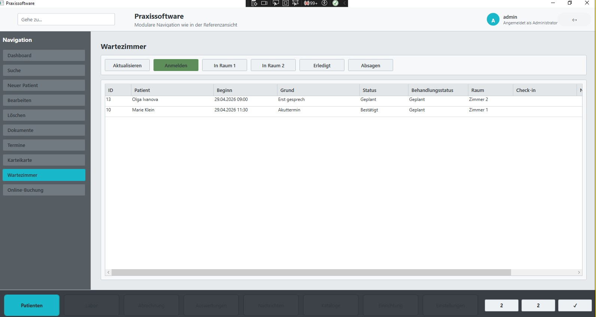


### Labor
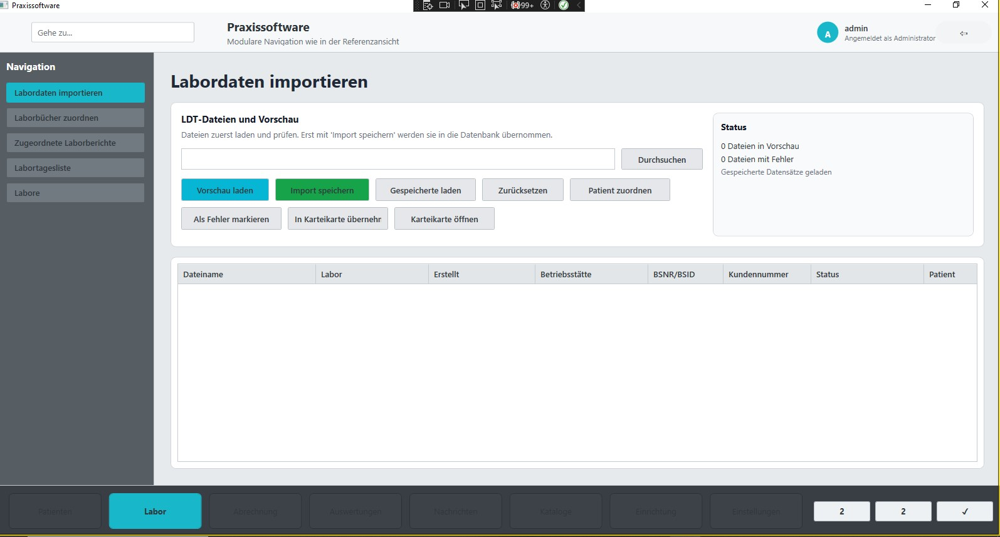

### Abrechnung
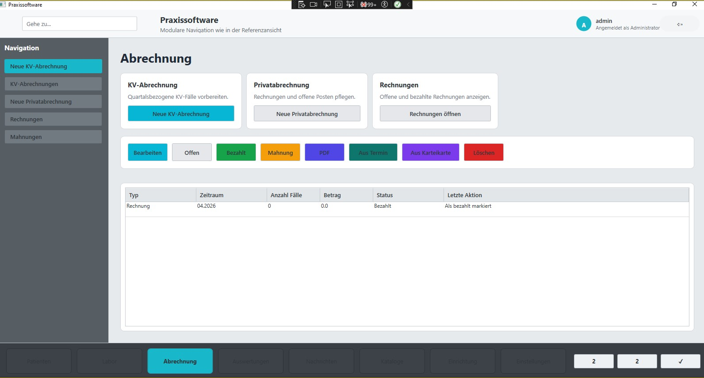

### Auswertungen
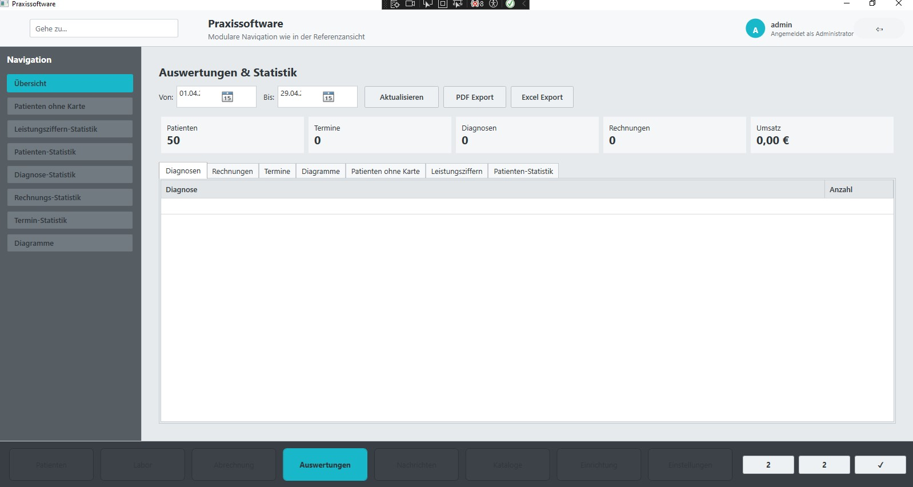

### Nachrichten
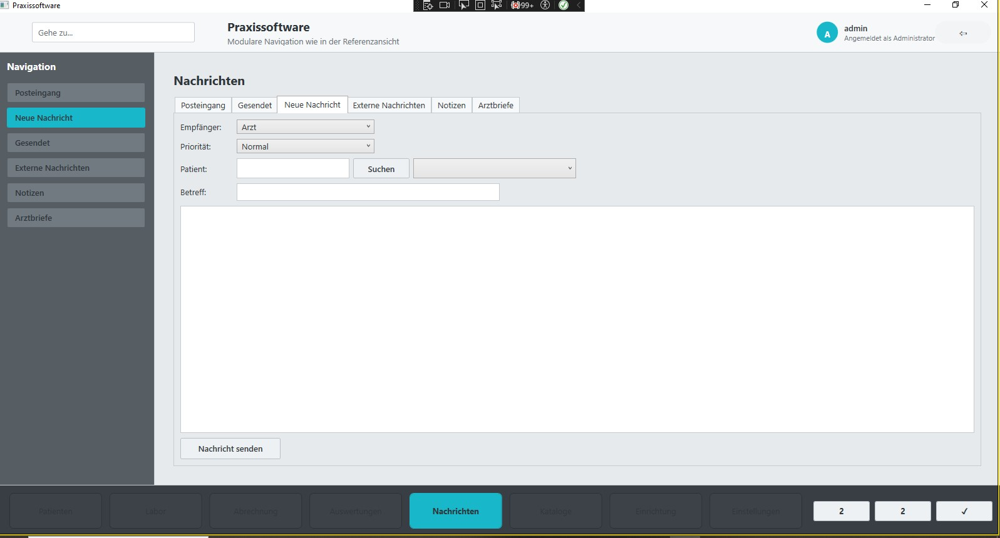

### Kataloge
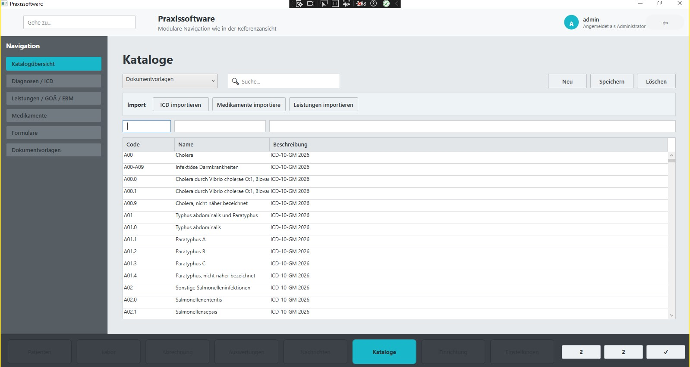

### Einrichtung
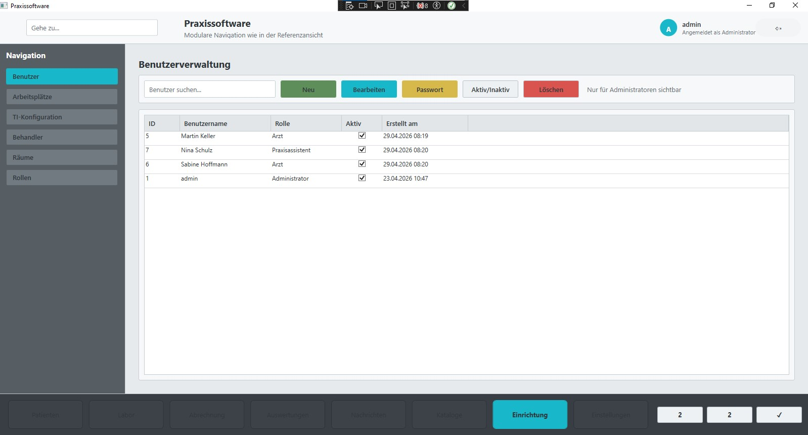
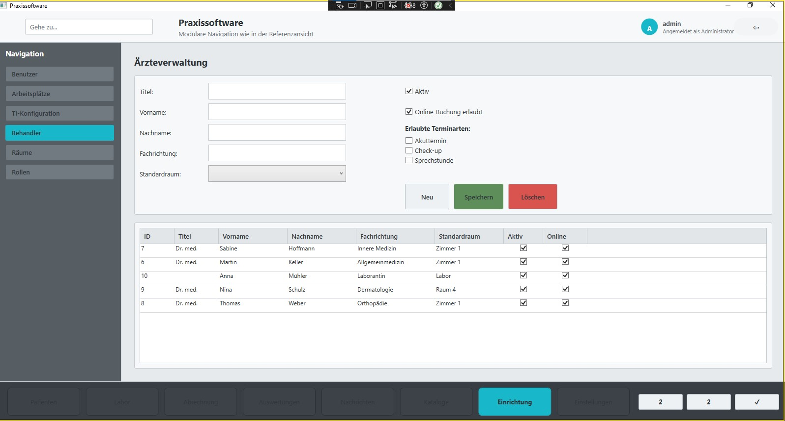
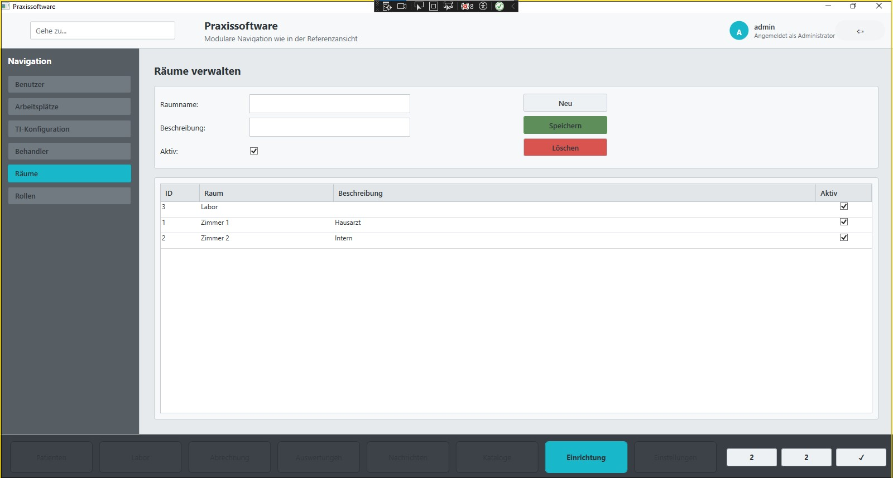


### Einstellungen
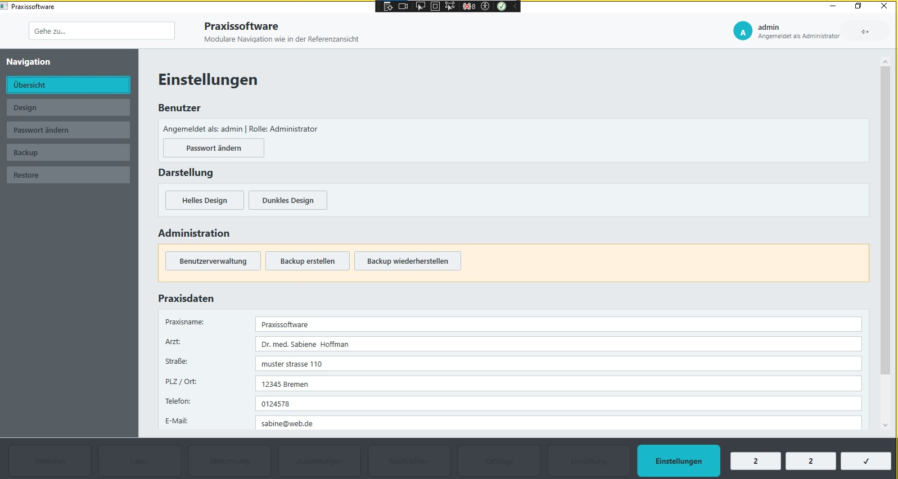

---

##  Mitwirken

Beiträge sind willkommen!

1. Fork erstellen
2. Feature-Branch erstellen
3. Änderungen committen
4. Pull Request erstellen

---

##  Lizenz

Alle Rechte vorbehalten. Die Nutzung, Vervielfältigung oder Weitergabe dieses Codes ist ohne ausdrückliche Genehmigung nicht gestattet.

---

##  Autor

* Aveen Al-Hadad

---
